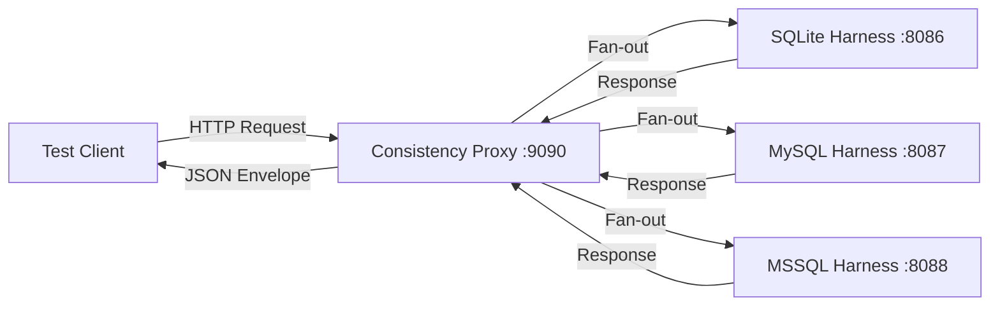
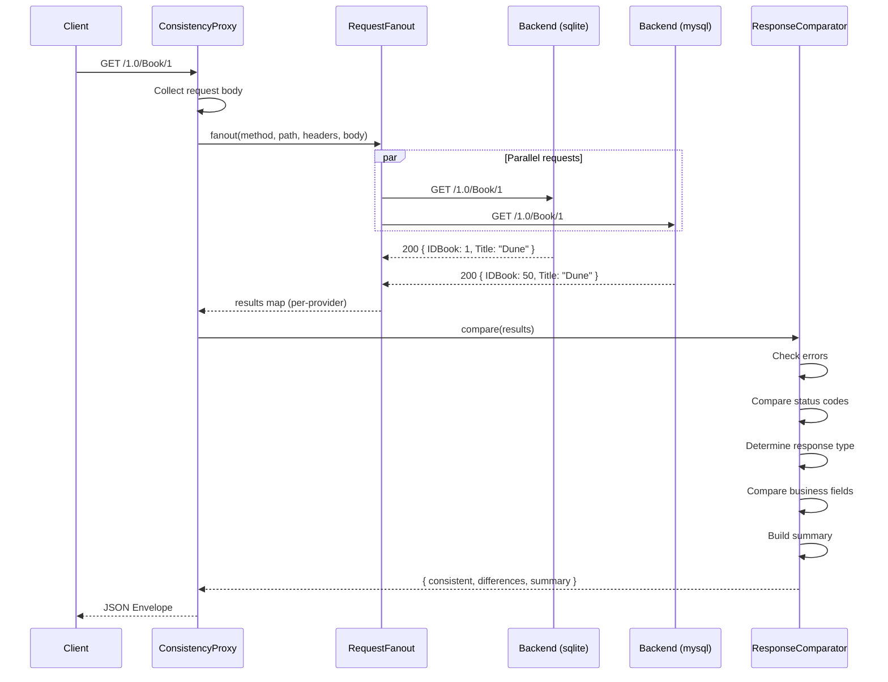
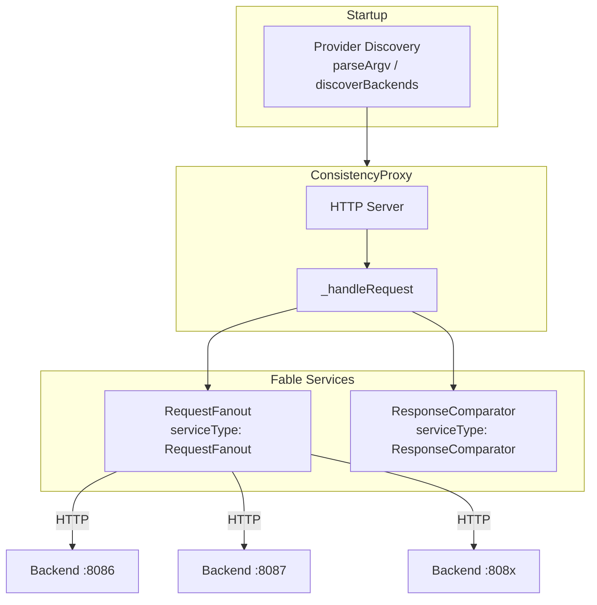
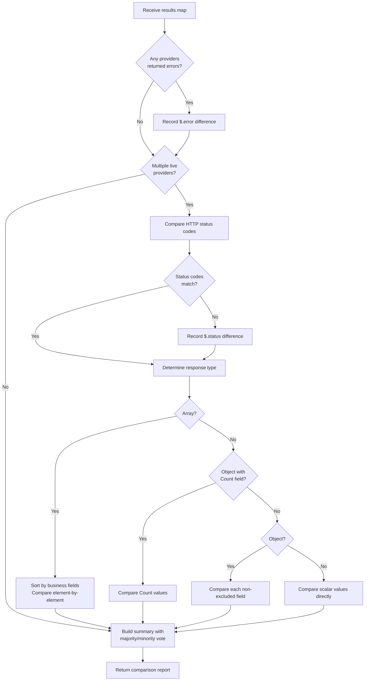

# Architecture

This document describes the internal architecture of the retold-harness
consistency proxy, including component responsibilities, request flow,
and design decisions.

## High-Level Overview

The consistency proxy sits between a test client and multiple retold-harness
backends. Each backend runs the same Meadow REST API against a different
database provider (SQLite, MySQL, MSSQL, PostgreSQL, etc.). The proxy
receives a single HTTP request, fans it out to every backend in parallel,
collects the responses, compares them field-by-field while ignoring
auto-generated values, and returns a JSON envelope describing agreement
or differences.

## Request Flow

The following sequence diagram shows the full lifecycle of a single
request through the proxy:

## Component Diagram

The proxy is composed of four modules. Three are instantiated at
construction time; Provider Discovery is used only during startup.

### ConsistencyProxy

The main class. Creates a Fable instance, registers the two services,
starts an HTTP server, and wires up the request handler. It owns the
lifecycle (`start`, `stop`) and the backend resolution logic.

- **Source:** `Retold-Harness-Consistency-Proxy.js`
- **Responsibilities:** HTTP server, body collection, envelope assembly,
  logging, graceful shutdown

### RequestFanout

A Fable service (`fable-serviceproviderbase`) that holds the backend map
and sends identical HTTP requests to all backends in parallel.

- **Source:** `Service-RequestFanout.js`
- **Service type:** `RequestFanout`
- **Key methods:** `setBackends(pBackends)`, `getBackends()`,
  `fanout(pMethod, pPath, pHeaders, pBody, fCallback)`
- **Header handling:** Strips `host`, `connection`, `transfer-encoding`,
  and `keep-alive` before forwarding. Recalculates `content-length` when
  a body is present.
- **Timeout:** 10000ms per request (configurable via `_timeoutMs`)

### ResponseComparator

A Fable service that normalizes and diffs the collected responses.

- **Source:** `Service-ResponseComparator.js`
- **Service type:** `ResponseComparator`
- **Key method:** `compare(pResults)` returns
  `{ consistent, providerCount, differences, summary }`
- **Response type detection:** object, array, count (`{Count: N}`), scalar
- **Field exclusion:** Skips ID columns, GUID columns, timestamps, and
  audit user fields
- **Value normalization:** Coerces numeric strings to numbers and unifies
  `null`/`undefined` to `null`
- **Array handling:** Sorts arrays by the first non-excluded string field
  before element-by-element comparison

### Provider Discovery

A utility module (not a Fable service) used at startup for CLI argument
parsing and port probing.

- **Source:** `Provider-Discovery.js`
- **Key functions:** `parseArgv()`, `parseBackendsArg(pBackendsArg)`,
  `probePort(pPort, fCallback)`, `discoverBackends(fCallback)`
- **Probe endpoint:** `GET /1.0/Books/Count` on `127.0.0.1` with a
  2-second timeout

## Comparison Pipeline

The `ResponseComparator.compare()` method follows this pipeline:

## Design Decisions

### Why a Splitter Proxy?

The proxy pattern allows existing test suites and HTTP clients to run
unmodified against multiple backends. Instead of writing comparison logic
inside every test, the proxy handles fan-out and diffing transparently.
A single `curl` command exercises all backends at once.

### Why Fable Services?

The `RequestFanout` and `ResponseComparator` are registered as Fable
services so they can be swapped, extended, or accessed by other parts
of a larger Fable application. This follows the Retold ecosystem
convention of building on `fable-serviceproviderbase`.

### Why Exclude IDs and Timestamps?

Each database provider maintains its own auto-increment sequences and
timestamps. A record created in SQLite might have `IDBook: 1` while the
same record in MySQL has `IDBook: 50`. These differences are expected and
not meaningful for consistency testing. The exclusion patterns remove this
noise so the comparison focuses on business data.

### Why Sort Arrays Before Comparison?

Different databases may return records in different default orders. Sorting
by the first non-excluded string field produces a stable ordering that
makes element-by-element comparison meaningful regardless of each
provider's native sort behavior.

### Why Majority-Vote Summaries?

When three or more backends are compared, a simple "match or not" answer
is insufficient. The majority-vote summary identifies which specific
provider(s) diverge from the consensus, making it straightforward to
locate the source of an inconsistency.

### Why a 10-Second Fanout Timeout?

The 10-second timeout is generous enough for queries against loaded
databases while preventing the proxy from hanging indefinitely when a
backend is unresponsive. The 2-second timeout for discovery probes is
shorter because those are lightweight count queries used only at startup.
